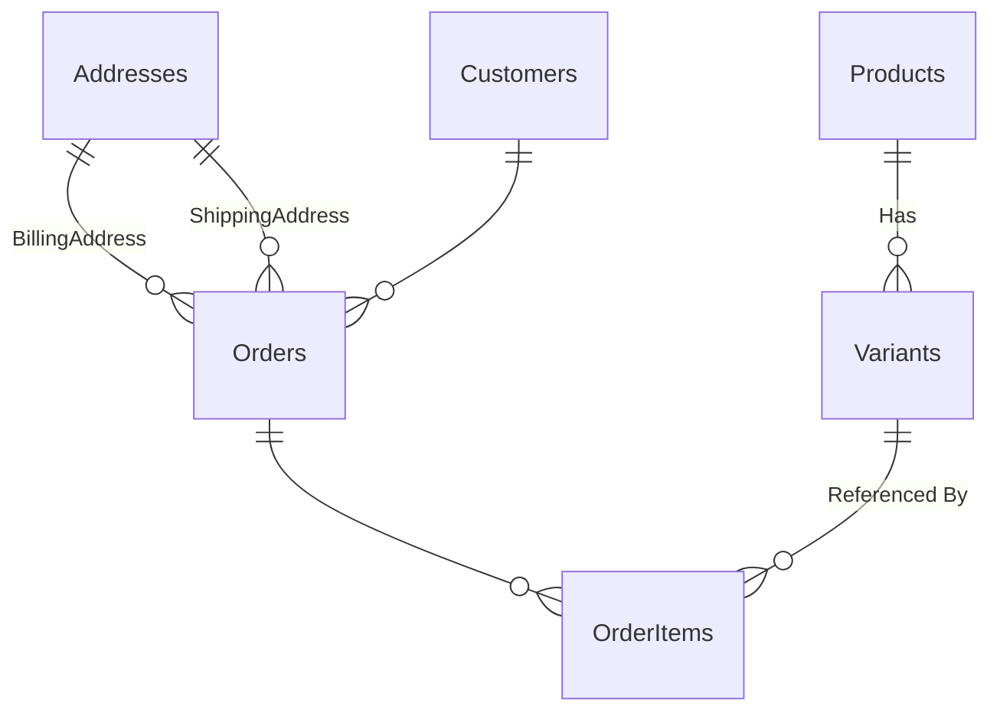

# Entity-Relationship Diagram (ERD)

This markdown file contains a representation of the Entity Framework model as an ER diagram using Mermaid syntax. The diagram illustrates the entities and the relationships between them.  These are the same as the database tables.

You can see these relationships in the domain entities.  If you are unfamiliar with Entity Framework then please lookup navigation properties to help you understand this.

If you are unfamiliar a product is the group concept but a variant is the individual item you might purchase e.g. a product is cola but you buy a variant which is a 500ml, 1l or 2l bottle.

If you would like to view this diagram you can open it in VS Code with a mermaid extension.

## Mermaid Diagram

